# AirLift V2 Controller

The **AirLift V2 Controller** is a man-in-the-middle controller that sits inline
between an **AirLift V2 Controller controller** and the **air-management
manifold**. It **decodes the proprietary 9600-baud LIN-wired protocol**
in both directions, **rewrites frames if required** so a phone or the vehicle can
drive presets and manual air-up/down without ever desyncing the OEM Controller,
and **reads the vehicle CAN bus** for ignition sensing, lock/unlock triggers (like key fob)
and a live pressure broadcast. Everything is configured from a phone over
**Wi-Fi** — no laptop or serial cable needed in the car.

It runs on the same **ESP32 DevKit V1 (WROOM-32)** PCB as the
[MFSW Controller](https://forbes-automotive.com/products/lin-mfsw-controller),
under the Arduino framework, using both hardware UARTs for the two LIN sides and
the ESP32 **TWAI** peripheral for CAN.

> The firmware acts as a relay and only intercepts
> the manifold bus transiently while a command is queued — control always
> returns to the controller automatically.

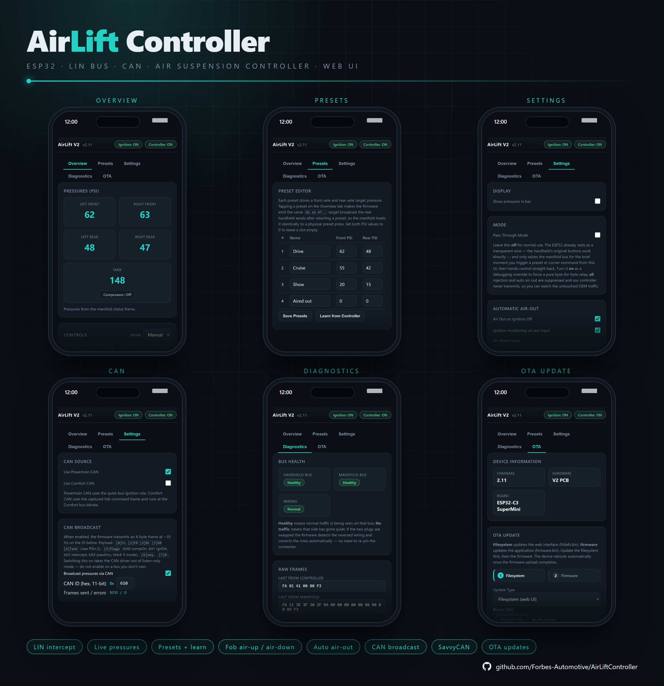

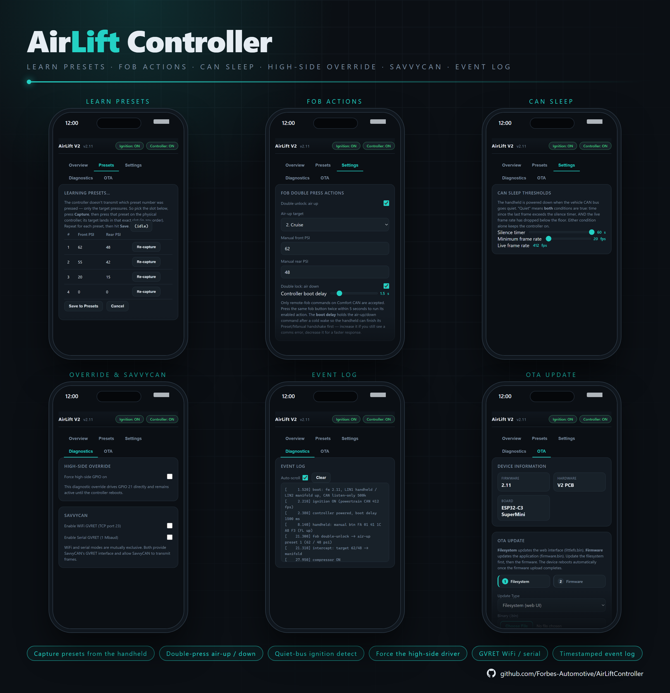


---

## Features at a Glance

| Feature | Detail |
|---|---|
| Dual-LIN | Dual LIN channels for Controller (UART1) and manifold (UART2) in dedicated FreeRTOS tasks |
| AirLift Decoder | Decodes every observed frame: FA/F3 polls & replies, the 17-byte status frame, and the 14-byte format-B pressure broadcast |
| Rewrite-in-flight injection | Presets, manual buttons, mode-switch — with verified checksums; the manifold only ever sees one continuous master, so it can't desync |
| Preset editor | Each of 8 presets stored as a `(frontPsi, rearPsi)` in EEPROM, plus a live **Learn** capture from the Controller to allow the user to learn each preset |
| Auto air-out | On ignition loss, broadcast the configured "air-down" target (preset or manual), hold, then turn off manifold power |
| CAN / TWAI | Powertrain quiet-bus ignition detection **or** Comfort-CAN lock/unlock triggers, plus a ~10 Hz pressure broadcast onto the selected bus |
| SavvyCAN GVRET | Capture/inject CAN over Wi-Fi (TCP 23) or USB serial for reverse-engineering |
| Lock/unlock air actions | A double fob-unlock airs the car up; a double fob-lock airs it down (both individually selectable) |
| High-side driver | Powers the controller whenever the vehicle is awake, with configurable CAN silence / min-FPS thresholds |
| Wi-Fi UI | Overview, Presets, Settings, Diagnostics, OTA |
| Power management | Auto Wi-Fi-off + CPU reduction 1 minute after the last client disconnects; a fresh CAN burst wakes it back up |
| OTA updates | Flash new firmware from the browser over Wi-Fi |
| EEPROM storage | All settings and presets stored to ESP32 Preferences |

---

### Purchase

The controller runs on the same PCB as the LIN MFSW Controller, available here:
[LIN MFSW Controller — Forbes Automotive](https://forbes-automotive.com/products/lin-mfsw-controller)

---

## Compatibility

Designed for the **AirLift V2** controller + manifold pair that communicate over a
**9600-baud 8N1 LIN-transceiver bus**. The controller is the **bus master** (the
bus is silent when it is unplugged). Frame formats, button codes and checksums
in [`include/defs.h`](include/defs.h) were reverse-engineered from live Saleae
captures (see [`Documents/`](Documents/)) — treat them as a known-good baseline
and re-verify against your own hardware before relying on any injected output.

CAN frame IDs (Comfort fob, broadcast) are **VW PQ-specific** and configurable.

---

## Hardware Overview

### External Interfaces

| Function | Part / circuit |
| --- | --- |
| Controller LIN (LIN 1) | LIN transceiver on `Serial1`, 9600 8N1 — the controller is the master, this device relays it |
| Manifold LIN (LIN 2) | LIN transceiver on `Serial2`, 9600 8N1 — the manifold is the slave |
| CAN | ESP32 TWAI + transceiver (TJA1050 / SN65HVD230); 500 kbit/s Powertrain or 100 kbit/s Comfort |
| Ignition sense (aux) | Optional 12 V level input on the shared aux pin (GPIO 39, input-only) for instant ignition |
| High-side driver | Transistor output (OUTPUT1) supplies +12 V to the controller during ignition-off air-out (5A max.) |

### Pin Map

Defined in [`include/defs.h`](include/defs.h):

| Group | Signal | GPIO |
| --- | --- | --- |
| LIN 1 (Controller) | TX / RX | 17 / 16 |
| LIN 2 (manifold) | TX / RX | 23 / 22 |
| LIN transceivers | Wake / CS-EN | 18 / 19 |
| CAN / TWAI | RX / TX | 13 / 14 |
| Ignition sense | Aux input (input-only pin) | 39 |
| High-side driver | Controller +12 V ("PNP") | 21 |

UARTs are 9600 8N1; CAN is 500 kbit/s (Powertrain) or 100 kbit/s (Comfort).

### Main Connector

The device breaks out to a single 12-way **MX23A12NF1** connector (shared PCB
with the MFSW controller):


> Viewed into the mating face: the top row runs pin **1** (right) to pin **6**
> (left), and the bottom row runs pin **7** (right) to pin **12** (left).

| Pin | Signal | AirLift use |
| --- | --- | --- |
| 1 | `PWR_IN` | 12 V switched / ignition supply |
| 2 | `GND` | Ground |
| 3 | `LIN1` | Controller LIN bus |
| 4 | `LIN2` | Manifold LIN bus |
| 5 | `CHASSIS_CANH` | CAN high |
| 6 | `CHASSIS_CANL` | CAN low |
| 7 | `ANALOG_LIGHT_IN` | Optional ignition-sense input (aux) |
| 8 | `RA` | Unused (resistive output not populated) |
| 9 | `5V` | 5 V rail — typically not required |
| 10 | `OUTPUT1` | Controller +12 V high-side driver |
| 11 | — | Unused |
| 12 | — | Unused |

---

## Jumpers

The shared PCB carries three configuration jumpers:


### LIN1_MASTER

Master pull-up on **LIN 1** (the controller bus). The AirLift Controller provides
the bus master, so this jumper is normally **left off** on the adapter — fit it
only if bench-testing without the real Controller attached.

### LIN2_MASTER

Master pull-up on **LIN 2** (the manifold bus). Fit it if the adapter must
provide the master pull-up on the manifold side; remove it if the manifold
harness already supplies one.

### R_TERM1

The **CAN bus termination resistor**. If this is the only device on the CAN
network leave it fitted; if the vehicle bus is already terminated, remove it.

---

## How It Works

The two LIN sides and the CAN bus each run in dedicated FreeRTOS tasks. The
firmware never seizes the manifold bus outright — the real Controller keeps
polling at its own rate and the firmware simply **rewrites those
frames as they pass through**. Because the manifold only ever sees one
continuous, correctly framed master it can never desync.

```
Controller LIN (master)                Manifold LIN (slave)              Vehicle CAN
        │                                   ▲                              │
        ▼ ControllerToManifoldTask (core 1)   │ manifoldToControllerTask       ▼ ignitionTask (core 0)
 parse poll / button ────────────┐          │ (core 1)                pollCanRx()
        │                        │          │  parse status/pressure       │
   RESTING: byte relay ──────────┼──────────┘  RESTING: byte relay         ▼ switch(id):
        │                        │          ▲       │                 Comfort 0x291 → lock/unlock
   COMMAND: drop poll,           │          │       ▼                       │
   drive manifold ~20 Hz ────────┘   rewrite reply, credit-gated       air-up / air-down queue
        (transformControllerFrame)      relay back to Controller                │
                                                                            ▼ canBroadcastTick()
                                                                     8-byte pressure frame (~10 Hz)
```

### Resting vs. Command

- **Resting** (the default) is a real-time byte-for-byte relay in both
  directions. Both channels still parse a side-channel copy of the traffic, so
  pressures, mode and button state stay live without slowing the bus.
- **Command** (a queued web/CAN action) drops the Controller's messages and drives the manifold at the OEM's active ~20 Hz rate. 

### Air-up / Air-down Triggers

| Source | Action |
| --- | --- |
| Web UI preset / manual buttons | Queue a preset target or manual corner move |
| Ignition loss (`airOutOnIgnOff`) | Broadcast the configured air-down target, hold, drop Controller power |
| Comfort-CAN **double unlock** (`airUpOnFobDouble`) | Air up to the configured preset / PSI |
| Comfort-CAN **double lock** (`airDownOnFobDouble`) | Air down to the configured preset / PSI |

Manual-target moves are closed-loop: the firmware pulses the matching corner
button until the measured axle PSI reaches the target (within tolerance) or the
60s timeout expires.  This may need adjustment(!).

---

## LIN Protocol (Reverse-Engineered)

### Format A — FA-framed polls and replies

```
FA  <payload bytes>  F3
```

**Controller → Manifold (master polls)**

| Bytes                                          | Meaning                              |
|------------------------------------------------|--------------------------------------|
| `01 00 05`                                     | idle poll                            |
| `01 41 XX YY`                                  | MANUAL-mode button event, `YY = (0xC4 - XX) & 0xFF` |
| `01 14 40 00 00 00 B1`                         | PRESET-mode entry poll (state `0x40`, one-shot) |
| `01 14 43 00 00 00 AE`                         | PRESET-mode steady poll (state `0x43`) |
| `01 16 47 TL TR 0F TL TR CHK`                  | preset target broadcast; `TL`/`TR` = front/rear PSI × 2 |

**Manifold → Controller (slave replies)**

| Bytes              | Meaning                          |
|--------------------|----------------------------------|
| `10 F1 00 05`      | idle reply                       |
| `10 F1 04 01`      | reply, MANUAL mode               |
| `10 F1 01 04`      | reply, PRESET mode               |
| `10 0E 00 25 …`    | 17-byte status frame (see below) |

### Manual Button Codes (`01 41 XX YY`, payload[2])

Upper nibble = axle (5 = front, 6 = rear); lower nibble = one-hot bit per
(side, direction): bit0 = L-UP, bit1 = L-DOWN, bit2 = R-UP, bit3 = R-DOWN.

| Code | Button       |  | Code | Button         |
|------|--------------|--|------|----------------|
| 0x51 | FL_UP        |  | 0x61 | RL_UP          |
| 0x52 | FL_DOWN      |  | 0x62 | RL_DOWN        |
| 0x54 | FR_UP        |  | 0x64 | RR_UP          |
| 0x58 | FR_DOWN      |  | 0x68 | RR_DOWN        |
| 0x00 | release/idle |  | 0x80 | MODE_SWITCH (press+hold 1+5) |

Checksum: payload[3] = `(0xC4 - code) & 0xFF`.

### Format A — 17-byte status frame (Manifold → Controller)

```
FA 10 0E 00 MS  FL  RL  FR  RR  TANK  C8 00 00 00 33 00 CHK F3
```

- `payload[3]` = mode/compressor flags: bit5 (`0x20`) heartbeat, bit4 (`0x10`)
  poll-parity, bits0+2 (`0x05`) both set if the compressor is running.
- `payload[5..8]` = FL, RL, FR, RR raw PSI (× 1, **not** × 2).
- `payload[9]`    = tank raw PSI.
- `payload[16]`   = sum-checksum: `(0xFA + Σpayload[0..15] + chk) mod 256 == 0`.

### Format B — 14-byte pressure broadcast (idle-terminated, no FA/F3)

```
00 0A E6 7E   C8 00 4A 00   FL  FR  RL  RR  b12 b13
```

Pressure bytes are PSI × 2. Frame is terminated by ≥4 ms of bus silence
(`kFrameIdleMs`). Kept as a secondary pressure source; format-A status is
preferred when available.

> **Pressure Refresh Rate.** In resting mode pressures are parsed on
> *every* frame the manifold emits, so the on-device values are always as fresh
> as the bus allows. The dashboard now polls `/api/status` at 4 Hz (250 ms).
> The underlying rate is set by how often the manifold chooses
> to broadcast

---

## CAN / TWAI

- **Listen-only** by default; reset to NORMAL mode only when *CAN Broadcast* or
  SavvyCAN transmit is enabled, so the firmware never emits ACK/error bits onto
  a bus while just monitoring.
- Re-initialised in [`src/CAN.cpp`](src/CAN.cpp) (`canReinit()`) when the
  enable flag, ID or bus rate changes via `/api/settings`.

### CAN Source

Exactly one CAN bus is active at a time (a single TWAI controller can only run
at one bit-rate):

- **Powertrain CAN** (500 kbit/s, default) — quiet-bus / minimum-FPS ignition
  detection. Presence is decided by combined activity: silence longer than
  `canSilSec` (default 10 s) **and** frame rate below `canMinFps` (default 50) →
  ignition OFF.
- **Comfort CAN** (100 kbit/s) — parses lock/unlock. `pollCanRx()` feeds each
  frame to a simple `switch (frame.identifier)` case statement; the Comfort fob
  frame (`0x291`, byte 0 = `0x4B` unlock / `0x8B` lock) sets the lock state, and
  a **double** press within 5s queues the configured air-up (unlock) or
  air-down (lock) action.

### Lock/Unlock → Air-Up/Down 

```
Comfort frame 0x291 → canProcessFrame() switch → unlock/lock + double-press detect
                                              → comfortFobDoubleUnlock / …Lock flag
ignitionTask → sees flag → queueTarget(air-up | air-down) → manifold drive
```

### Pressure Broadcast (firmware → vehicle bus)

~10 Hz (`kCanBroadcastPeriodMs = 100`), user-configured 11-bit ID (default
`0x520`), DLC 8:

```
[0] FL PSI*2   [1] FR PSI*2   [2] RL PSI*2   [3] RR PSI*2   [4] Tank PSI*2
[5] flags: bit0 compOn | bit1 ignOn | bit2 intercept | bit3 passthru
          | bits4-5 mode (0=unknown,1=manual,2=preset)
[6] seq counter (free-running)   [7] reserved (0)
```

### SavvyCAN

Enable one setting on the **Diagnostics → SavvyCAN** card:

- **Wi-Fi GVRET**: connect SavvyCAN to `192.168.1.1:23` as a GVRET network device.
- **Serial GVRET**: connect SavvyCAN to the USB serial port at `1,000,000` baud.

All received frames are forwarded through a queue; SavvyCAN transmit
requests are sent to the vehicle bus while either transport is active.

<p align="center">
  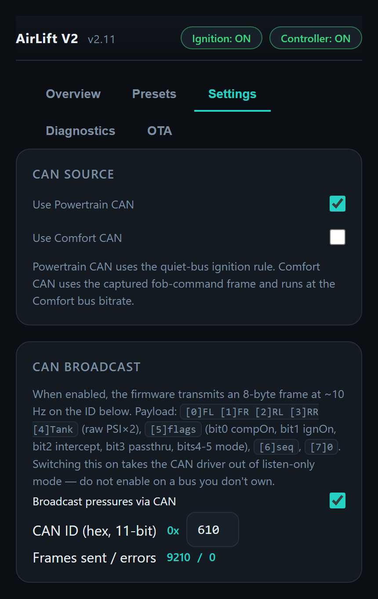
  &nbsp;&nbsp;
  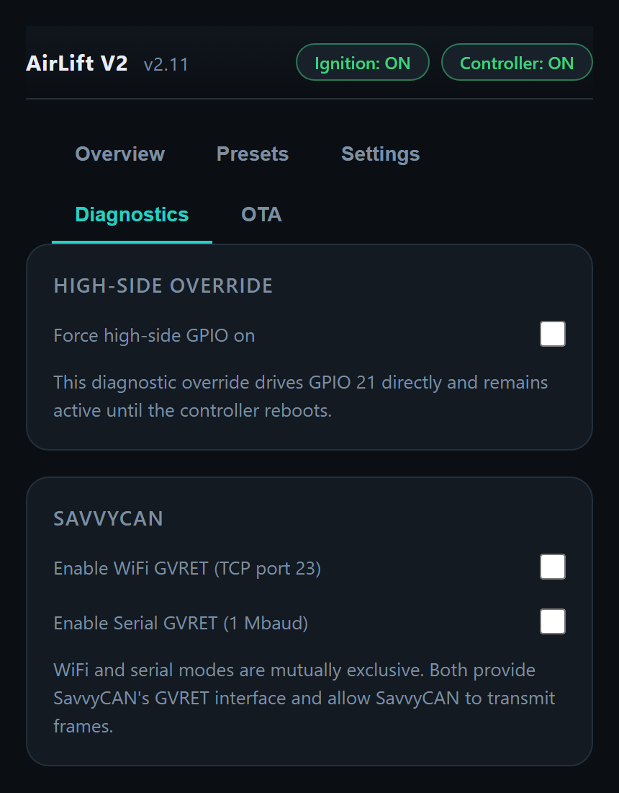
</p>

*Settings → CAN Source and CAN Broadcast (left); Diagnostics → High-Side Override and SavvyCAN (right).*

---

## Power Management

The firmware bundles the universal `power_manager` module used across the
projects. Power state follows the **Wi-Fi client count**, and CAN traffic is the
**wake source** — matching the "sleep when idle, wake when you return to the car"
behaviour:

1. **Boot** — Wi-Fi AP is up and full power.
2. **Idle** — **1 minute after the last Wi-Fi client disconnects**, the module
   turns the WiFi off, drops the CPU 240 MHz → 80 MHz, and clears any web
   override so the controller rests as a pure pass-through. This happens even while the
   car is running (CAN active), keeping the linear regulator cool.
3. **Wake** — while reduced, the TWAI controller keeps receiving (we never
   light-sleep, so no wake interrupt is needed — `ignitionTask` drains the RX
   FIFO every 100 ms). When the bus goes from **quiet → active** and a genuine
   **burst of ≥ `kCanWakeFrameMin` (8) frames** arrives, the board wakes and
   rebuilds the AP for the idle window. It sleeps again 1 minute later if no
   client connected.

> Lock/unlock parsing and air-up/down run in `ignitionTask` and are **independent
> of Wi-Fi** — a fob double-unlock airs the car up whether or not the WiFi is
> awake. The wake-on-burst only restores the web UI.

| Action | Saving |
| --- | --- |
| Wi-Fi off | ~80–120 mA average (single biggest) |
| CPU 240 MHz → 80 MHz | Moderate reduction in active current |
| Bluetooth controller released at boot | ~60 KB RAM freed; small idle saving |
| Onboard LED off at boot | Tiny but persistent saving |

A single stray CAN frame will **not** wake the AP, and a continuous stream that
started while awake will **not** re-wake it after it sleeps — only a fresh
quiet-to-active burst does. An ignition power-cycle always brings Wi-Fi back.

The quiet-bus detection itself is tuned on **Settings → CAN Sleep Thresholds**: the
**silence timer** (`canSilSec`) and **minimum frame rate** (`canMinFps`) both have to be
crossed before the handheld is powered down, and the live frame rate is shown next to them
so you can see what the parked bus actually does.

<p align="center">
  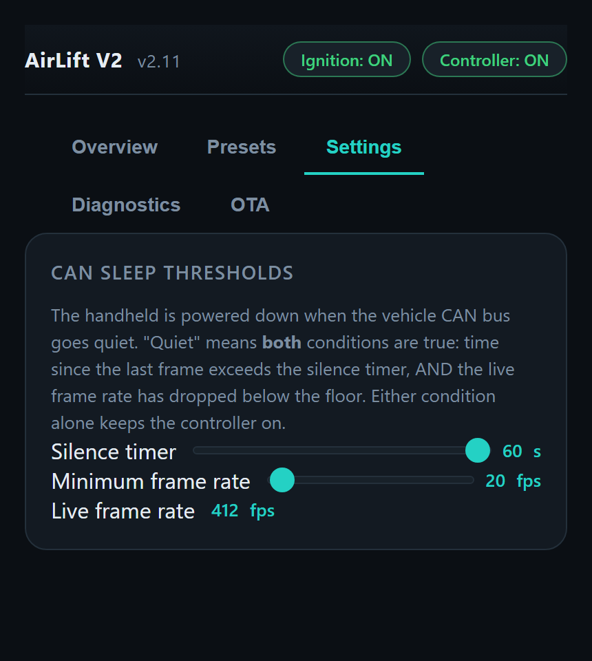
</p>

---

## Wi-Fi & Web Interface

Connect to the **`AirLift-V2 Controller`** Wi-Fi access point (open network) and browse to
**`http://192.168.1.1/`** or **`http://airlift.local/`**. All changed settings are saved automatically. Current firmware version: **2.11**, shown next to the header title in the Web UI and built on Forbes Automotive's shared dark theme (the same look used across OpenHaldex, Can2Cluster, SpeedPulser, SpeedPulserPro, can2rpm and the MQB Steering Wheel Controller).

| Tab | Purpose |
| --- | --- |
| **Overview** | Live FL/FR/RL/RR/Tank PSI, compressor LED, mode, press-and-hold corner buttons (Pointer Events with a safety release), and bus health |
| **Presets** | 8 named buttons + inline `(frontPsi, rearPsi)` editor |
| **Settings** | Display units, pass-through / intercept mode, air-out-on-ignition-off, air-up/down on fob double-press (with targets and boot delay), CAN sleep thresholds (silence / min-FPS), CAN source, CAN broadcast ID |
| **Diagnostics** | Bus health (LIN handheld / manifold, CAN), raw LIN frames, system status tiles, high-side driver override, SavvyCAN GVRET toggles and a timestamped event log |
| **OTA** | Two-step firmware/web-UI update over Wi‑Fi — see [Over-the-Air Updates](#over-the-air-updates-two-step) below |


<p align="center">
  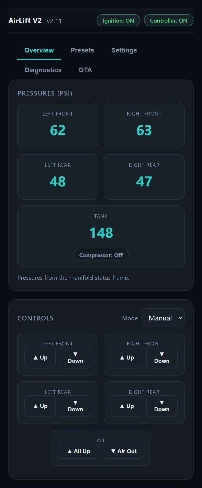
  &nbsp;&nbsp;
  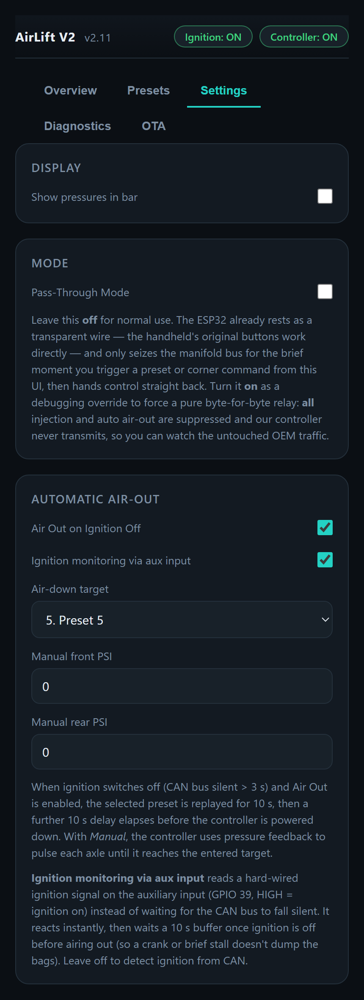
</p>
<p align="center">
  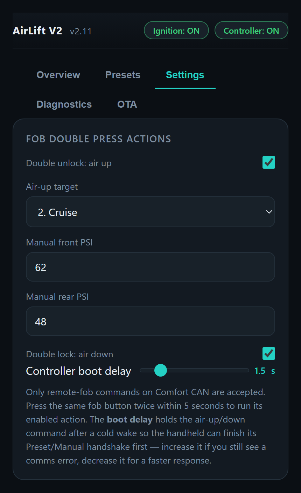
  &nbsp;&nbsp;
  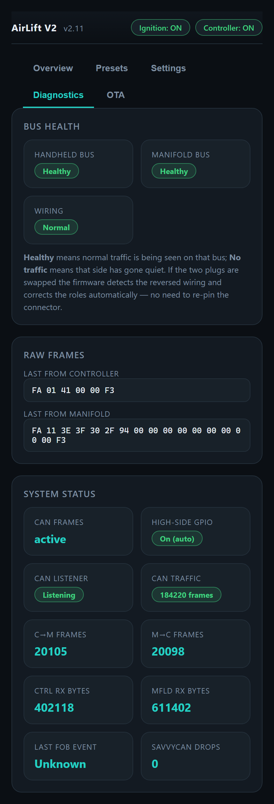
</p>

*Overview and the Settings cards for mode / auto air-out (top); the fob double-press actions and the Diagnostics bus-health, raw-frame and status cards (bottom). The CAN cards are shown under [CAN / TWAI](#can--twai) above.*

Every notable event — ignition, handheld button presses, fob actions, intercepted targets,
compressor state and broadcast counters — is also written to the **Event Log** on the
Diagnostics tab with a millisecond timestamp:

<p align="center">
  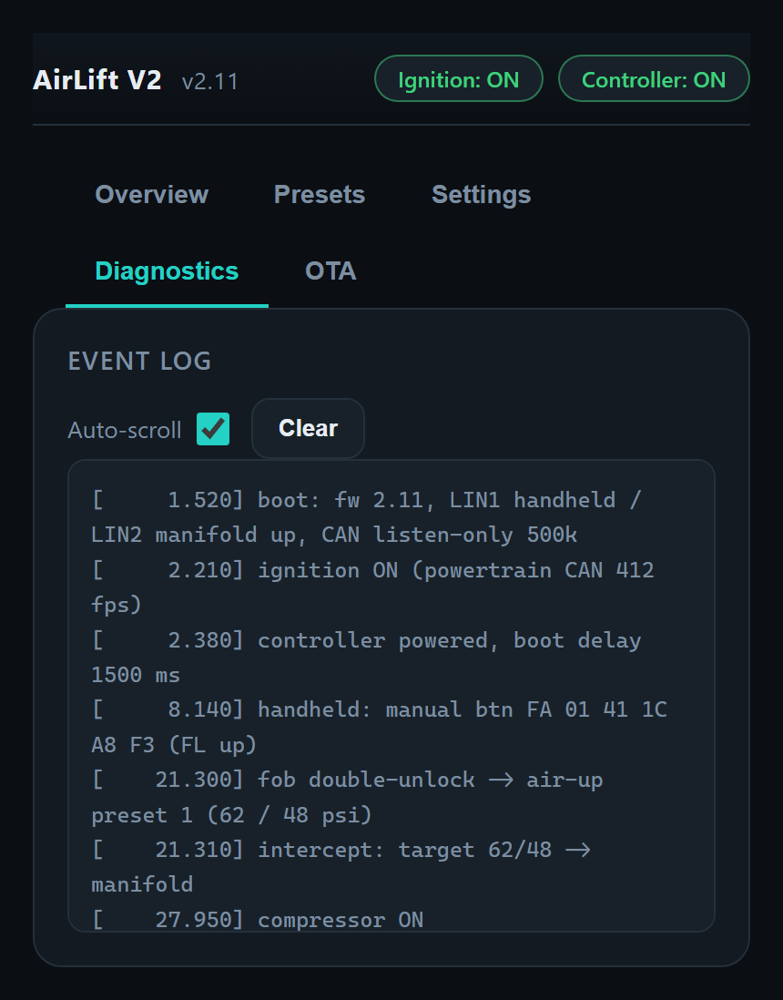
</p>

### Over-the-Air Updates (Two-Step)

Firmware and the web UI live on separate flash partitions, so an OTA update is done in two steps:

1. **Filesystem** — upload `littlefs.bin` (`POST /api/ota/fs`, written to the SPIFFS partition). Updates `index.html` / `app.js` / `style.css`; the device does **not** reboot after this step.
2. **Firmware** — upload `firmware.bin` (`POST /api/ota`, written to the OTA app partition). Updates the application and reboots automatically once complete.

`GET /api/ota/info` reports the running version.

### Status Indicators

Compressor, ignition/controller power and bus-diagnostics tiles use consistent colour-coded pills:

| Colour | Meaning |
|---|---|
| 🟢 Green | Compressor running, ignition/controller powered on, CAN listener/high-side driver active, LIN bus wiring normal and healthy, CAN traffic present |
| 🔴 Red | Compressor off/stale, ignition/controller off, CAN listener stopped, high-side driver off, or a LIN bus (handheld/manifold) is unhealthy |
| 🟠 Orange | A "no signal, not necessarily broken" condition — specifically **no CAN frames currently arriving**, or the LIN bus wiring is detected **reversed** |

The four corner/tank PSI gauges don't use these colours — they simply show `--` if the LIN bus data has gone stale for more than 5 seconds.

### Learn Mode

Enable a preset slot in the UI, then press the matching physical preset on the
Controller: the next `01 16 47 …` target broadcast on the wire is captured into
that slot (the wire carries no preset index, so the slot is bound to the button
you press). Learn windows time-out after a few seconds.


<p align="center">
  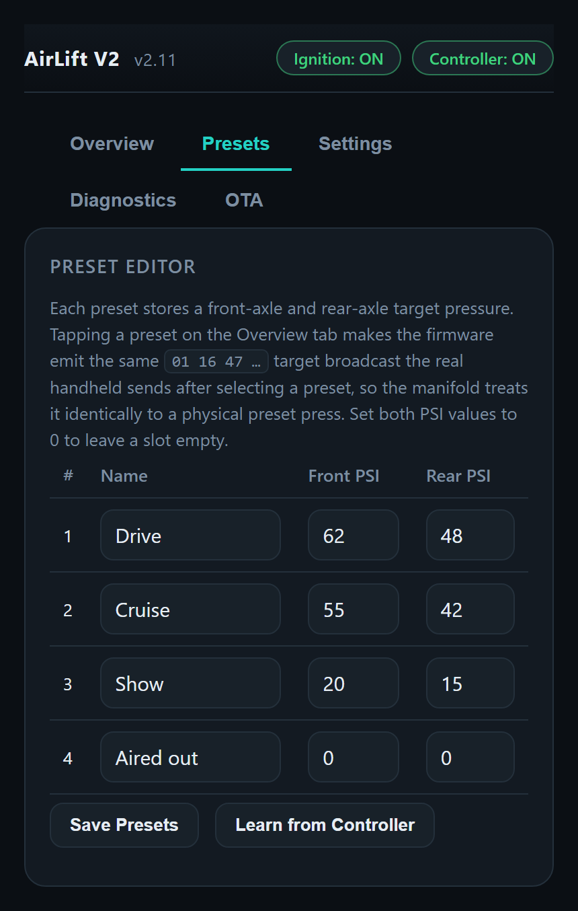
  &nbsp;&nbsp;
  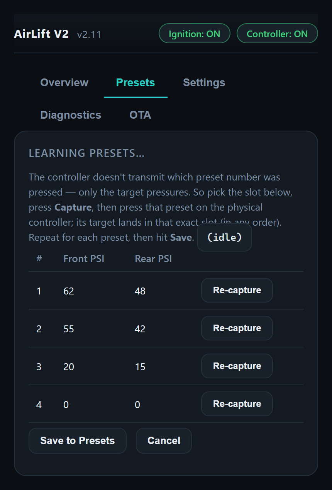
</p>

*Presets: the editor (left) and the learn card that **Learn from Controller** opens (right) — arm a slot, press that preset on the handheld, then Save.*

<p align="center">
  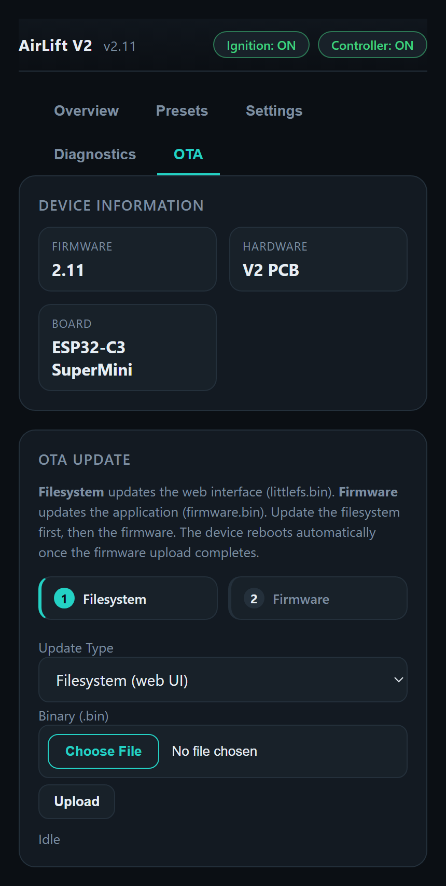
</p>

---

### Frame Builders

| Function                                            | Output                                     |
|-----------------------------------------------------|--------------------------------------------|
| `buildIdlePoll(out)`                                | `FA 01 00 05 F3`                           |
| `buildManualButtonPoll(code, out)`                  | `FA 01 41 XX (0xC4-XX) F3`                 |
| `buildPresetTargetPoll(frontPsi, rearPsi, out)`     | `FA 01 16 47 TL TR 0F TL TR CHK F3`        |
| `buildEnterManualPoll(out)` / `buildEnterPresetPoll(out)` | mode-switch / preset-entry polls     |

---

## Configuration

### Feature Flags

Serial debug is defined at the top of [`include/defs.h`](include/defs.h). Set `enableDebug 0` to turn off
everything in one place.  With it on, flip individual categories to focus on a
subsystem. Each category is ANDed with `enableDebug`, and every line is
auto-tagged (e.g. `[CAN]`, `[WiFi]`).

| Flag | Tag | Covers |
| --- | --- | --- |
| `enableDebug` | — | **Master** — `0` disables all serial debug |
| `debugSys` | `[SYS]` | Boot + 1 Hz telemetry |
| `debugPower` | `[PWR]` | Reduced-power / wake (power_manager) |
| `debugWifi` | `[WiFi]` | Soft-AP bring-up |
| `debugIO` | `[IO]` | High-side / controller power / UART init |
| `debugCAN` | `[CAN]` | TWAI driver, vehicle CAN, fob, wake-burst |
| `debugLIN` | `[LIN]` | AirLift LIN MITM (wire / mode / buttons) |
| `debugAPI` | `[API]` | REST / settings / OTA |
| `debugSavvy` | `[SAVVY]` | SavvyCAN GVRET control |

> Serial runs at `serialDebugBaud` (115200). Note: enabling **SavvyCAN Serial
> GVRET** takes over the USB UART at 1 Mbaud, so serial debug and serial GVRET
> are mutually exclusive.

### Key Defaults

| Setting | Default |
| --- | --- |
| LIN Baud | 9600 8N1 |
| CAN Source | Powertrain (500 kbit/s) |
| CAN Silence / min-FPS | 10 s / 50 fps |
| CAN Broadcast ID | `0x520` (disabled by default) |
| Comfort Fob ID / Unlock / Lock | `0x291` / `0x4B` / `0x8B` |
| Fob Double-press Window | 5 s |
| Wi-Fi Idle Timeout | 60 s (after last client) |
| CAN Wake-burst Minimum | 8 frames |
| Wi-Fi AP / IP | `AirLift-V2 Controller` / `192.168.1.1` |
| Pass-through Mode | ON (safe boot default) |

Settings persist to ESP32 Preferences (EEPROM)

---

## Version History

```
V1.00 — ESP32 rewrite: dual-UART rewrite-in-flight MITM, Wi-Fi UI, preset editor.
V2.01 — CAN/TWAI bridge (Powertrain/Comfort), pressure broadcast, SavvyCAN GVRET.
V2.10 — power management (Wi-Fi-client idle + CAN wake-on-burst),
        deferred WiFi bring-up on wake, high-side auto-release, fob boot-delay,
        command-mode idle masking, and single-master gated serial debug.
V2.11 — shared UI theme; common wifi_manager (airlift.local) + ota_manager
        (two-step firmware + filesystem OTA, /api/ota + /api/ota/fs); cache-busting.
```

---

## Disclaimer

Forbes Automotive accepts no responsibility for any incidents arising from the
use of this adapter. Frame IDs, button codes and calibration are vehicle- and
hardware-specific — verify against your own setup before relying on any injected
output or automatic air action.
